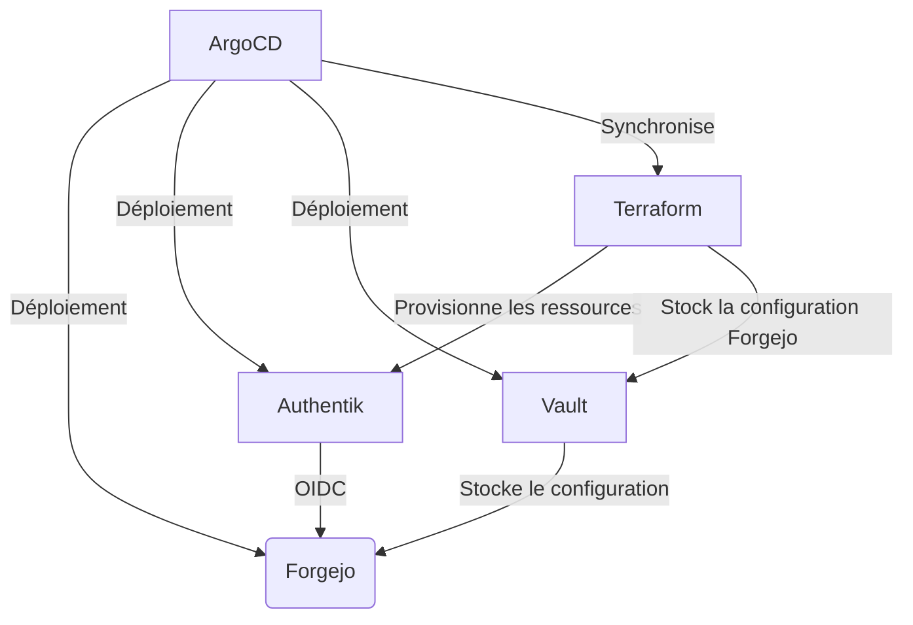

Bienvenue dans cette suite d'article destiné a présenter l'intégration mise en place afin d'avoir une forge Git auto-hébergée fonctionnelle au sein de l'environnement Weebo GitOps. Cette forge a donc pour objectif de permettre une gestion GitOps autant que possible.

Ceci n'est pas un tutoriel pas à pas, mais plutôt une présentation de l'installation de Forgejo basique, l'installation complète sera l'objet d'un prochain article dédié au setup a travers la stack Weebo GitOps, incluant toute la configuration de l'authentification via Terraform et Vault ainsi que la délégation de la gestion des identité.

Cette article est le premier d'une série d'article dédié a la partie Git de Weebo GitOps:

1. [Mise en place d'une forge Git auto-hébergée (Forgejo)](/docs/project/weebogitops/git/1-setup-forgejo)
2. Configuration d'un runner Forgejo dans Kubernetes
3. Délégation et trust de l'identité d'une ci forgejo vers Vault et ArgoCD
4. Délégation et trust de l'identité d'une ci forgejo vers Kubernetes
5. Pipeline de bout en bout pour déployer une application GitOps avec Forgejo, ArgoCD et Vault
6. Mise en place d'un équivalent Github Pages

## Choix de la forge Git

Par le passé, j'ai pue mettre en place autant Gitlab, Gogs que Gitea. Mais cette fois-ci, Forgejo a été choisi pour héberger les dépots Git et soutenir l'intégration GitOps et continue. Forgejo est un fork de Gitea, celui-ci est encore un work in progress vis a vis de certaine feature mais permet d'avoir un controle total sur ce qui est déployé.

## Déploiement de Forgejo

### Prérequis

- Un cluster Kubernetes fonctionnel
- ArgoCD installé et configuré
- Un namespace dédié pour Forgejo (ex: `forgejo`)
- Un stockage persistant pour les données de Forgejo (ex: PVC)
- Un Ingress ou LoadBalancer pour accéder à Forgejo



### Note

- `git.example.com` doit être remplacé par le domaine que vous souhaitez utiliser pour accéder à Forgejo.
- `auth.example.com` doit être remplacé par le domaine de votre fournisseur d'authentification OIDC (Authentik dans ce cas).
- Un secret `git-auth` doit être créé dans le namespace `forgejo` contenant les informations d'identification pour l'authentification OIDC (client ID et client secret).
- Le provider OIDC dans l'exemple est Authentik, mais vous pouvez facilement le remplacer par un autre fournisseur compatible OIDC.
- La configuration OIDC appliquée a Forgejo peut étre retrouver assez facilement depuis mon repo [Github](https://github.com/batleforc/Weebo5GitOps/blob/main/1.argo/terra/auth/terra-map/git.tf) ou son [miroir forgejo](https://git.batleforc.fr/batleforc/Weebo5GitOps/src/branch/main/1.argo/terra/auth/terra-map/git.tf)
- Cert Manager est utilisé et configuré avec un ClusterIssuer nommé `outbound` pour gérer les certificats TLS, assurez-vous que cela est en place avant de déployer Forgejo.
- Traefik est utilisé comme Ingress Controller, assurez-vous d'avoir un ingress configuré correctement.

### Installation de Forgejo

L'installation de Forgejo peut assez facilement être réalisée à l'aide d'un chart Helm et ArgoCD. Voici le contenue d'une application ArgoCD pour déployer Forgejo :

```yaml
apiVersion: argoproj.io/v1alpha1
kind: Application
metadata:
  name: forgejo
  namespace: argocd
spec:
  project: default
  syncPolicy:
    automated: {}
    syncOptions:
    - ServerSideApply=true
  source:
    chart: forgejo
    repoURL: oci://code.forgejo.org/forgejo-helm/forgejo
    targetRevision: 17.0.0
    helm:
      releaseName: forgejo
      valuesObject:
        ingress:
          enabled: true
          annotations:
            kubernetes.io/ingress.class: "traefik"
            cert-manager.io/cluster-issuer: "outbound"
          hosts:
          - host: git.example.com
            paths:
            - path: /
              pathType: Prefix
          tls:
          - hosts:
            - git.example.com
            secretName: git-tls
        image:
          rootless: true
        persistence:
          enabled: true

        gitea:
          admin:
            username: ""
            existingSecret: ""
          config:
            APP_NAME: "Mon Super Git"
            indexer:
              REPO_INDEXER_ENABLED: true
            service:
              DISABLE_REGISTRATION: true
            oauth2_client:
              ENABLE_AUTO_REGISTRATION: true
          oauth:
            - name: 'mon-super-sso'
              provider: 'openidConnect'
              autoDiscoverUrl: 'https://auth.example.com/application/o/git/.well-known/openid-configuration'
              existingSecret: "git-auth"
              scopes: "openid profile email git"
              groupClaimName: "forgejo"
              adminGroup: "admin"
              restrictedGroup: "restricted"
              requiredClaimName: "forgejo"
  destination:
    namespace: forgejo
    server: https://kubernetes.default.svc
```

Dans cet exemple, Forgejo est déployé dans le namespace `forgejo` avec un Ingress configuré pour être accessible via `git.example.com`. L'authentification est configurée pour utiliser un fournisseur OpenID Connect (Authentik), ce qui permet une intégration facile avec des systèmes d'authentification externes. Ce setup nécessite également un secret nommé git-auth contenant le client ID et le client secret pour l'authentification OIDC.

Deux point sont a noter :

- L'enregistrement hors SSO est désactivé, si votre provider SSO ne fonctionne pas, vous ne pourrez pas vous connecter a Forgejo, assurez-vous que votre provider SSO est correctement configuré et fonctionnel avant de déployer Forgejo.
- L'auto enregistrement SSO est activé, si un utilisateur tente de se connecter a Forgejo via SSO et que celui-ci n'existe pas encore dans Forgejo, il sera automatiquement créé, assurez-vous que cela correspond a votre politique de sécurité.

Si vous souhaitez une installation plus complète, incluant toute la configuration de l'authentification via Terraform et Vault, vous pouvez actuellement retrouver tout le setup directement dans le repository [Weebo GitOps](https://github.com/batleforc/Weebo5GitOps), et a un prochain article dédié au setup a travers la stack Weebo GitOps.

### Préparation de forgejo pour GitOps

Une fois Forgejo installé, il est nécessaire de préparer la forge pour une utilisation GitOps. Pour ce faire, connectez-vous une premiére fois et créez un token qui sera uttiliser par Terraform pour pousser les dépots Git ou autre configuration. La configuration Terraform est trouvable dans le repo [Weebo GitOps](https://github.com/batleforc/Weebo5GitOps/tree/main/1.argo/terra/git) ou son miroir forgejo [ici](https://git.batleforc.fr/batleforc/Weebo5GitOps/src/branch/main/1.argo/terra/git).

Si vous avez suivi la configuration Weebo5GitOps, il est possible d'envoyer ce jeton directement dans vault depuis `task` et laisser Argo faire la resynchronisation de la partit Terraform. La commande `task vault:git API_TOKEN=<your-token>` est disponible pour cela, n'oublier pas avant de faire cette commande de sois lancer le port-forward de vault via `task vault:forward` ou d'avoir une autre méthode pour communiquer avec vault (Par exemple le vpn Netbird).

## Conclusion

Dans cet article, nous avons vu comment déployer Forgejo, une forge Git auto-hébergée, au sein de l'environnement Weebo GitOps. Nous avons également abordé la configuration de l'authentification OIDC pour permettre une intégration facile avec des systèmes d'authentification externes. Dans le prochain article, nous rentrerons plus en détail dans la configuration d'un runner Forgejo directement dans Kubernetes.

Pour aller plus loin dans l'installation de Forgejo, vous pouvez retrouver les article de [Stephane Robert sur le sujet](https://blog.stephane-robert.info/docs/services/devops/forgejo/)

## Liens utiles

- [Forgejo Helm Chart](https://code.forgejo.org/forgejo-helm/forgejo)
- [Documentation Forgejo](https://forgejo.org/docs/)
- [Authentik](https://goauthentik.io/)
- [Cert Manager](https://cert-manager.io/)
- [Traefik](https://traefik.io/)
