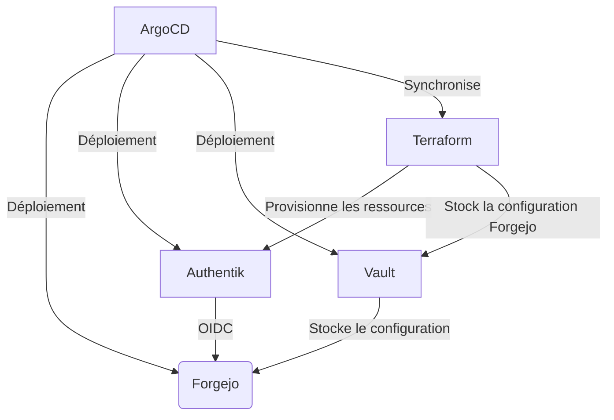

Bienvenue dans cette suite d'article destiné a présenter l'intégration mise en place afin d'avoir une forge Git auto-hébergée fonctionnelle au sein de l'environnement Weebo GitOps. Cette forge a donc pour objectif de permettre une gestion GitOps autant que possible.

Ceci n'est pas un tutoriel pas à pas, mais plutôt une présentation de l'installation de Forgejo basique, l'installation complète sera l'objet d'un prochain article dédié au setup a travers la stack Weebo GitOps, incluant toute la configuration de l'authentification via Terraform et Vault ainsi que la délégation de la gestion des identité.

## Choix de la forge Git

Par le passé, j'ai pue mettre en place autant Gitlab, Gogs que Gitea. Mais cette fois-ci, Forgejo a été choisi pour héberger les dépots Git et soutenir l'intégration GitOps et continue. Forgejo est un fork de Gitea, celui-ci est encore un work in progress vis a vis de certaine feature mais permet d'avoir un controle total sur ce qui est déployé.

## Déploiement de Forgejo

### Prérequis

- Un cluster Kubernetes fonctionnel
- ArgoCD installé et configuré
- Un namespace dédié pour Forgejo (ex: `forgejo`)
- Un stockage persistant pour les données de Forgejo (ex: PVC)
- Un Ingress ou LoadBalancer pour accéder à Forgejo



### Installation de Forgejo

L'installation de Forgejo peut assez facilement être réalisée à l'aide d'un chart Helm et ArgoCD. Voici le contenue d'une application ArgoCD pour déployer Forgejo :

```yaml
apiVersion: argoproj.io/v1alpha1
kind: Application
metadata:
  name: forgejo
  namespace: argocd
spec:
  project: default
  syncPolicy:
    automated: {}
    syncOptions:
    - ServerSideApply=true
  source:
    chart: forgejo
    repoURL: oci://code.forgejo.org/forgejo-helm/forgejo
    targetRevision: 17.0.0
    helm:
      releaseName: forgejo
      valuesObject:
        ingress:
          enabled: true
          annotations:
            kubernetes.io/ingress.class: "traefik"
            cert-manager.io/cluster-issuer: "outbound"
          hosts:
          - host: git.example.com
            paths:
            - path: /
              pathType: Prefix
          tls:
          - hosts:
            - git.example.com
            secretName: git-tls
        image:
          rootless: true
        persistence:
          enabled: true

        gitea:
          admin:
            username: ""
            existingSecret: ""
          config:
            APP_NAME: "Mon Super Git"
            indexer:
              REPO_INDEXER_ENABLED: true
            service:
              DISABLE_REGISTRATION: true
            oauth2_client:
              ENABLE_AUTO_REGISTRATION: true
          oauth:
            - name: 'mon-super-sso'
              provider: 'openidConnect'
              autoDiscoverUrl: 'https://auth.example.com/application/o/git/.well-known/openid-configuration'
              existingSecret: "git-auth"
              scopes: "openid profile email git"
              groupClaimName: "forgejo"
              adminGroup: "admin"
              restrictedGroup: "restricted"
              requiredClaimName: "forgejo"
  destination:
    namespace: forgejo
    server: https://kubernetes.default.svc
```

Dans cet exemple, Forgejo est déployé dans le namespace `forgejo` avec un Ingress configuré pour être accessible via `git.example.com`. L'authentification est configurée pour utiliser un fournisseur OpenID Connect (Authentik), ce qui permet une intégration facile avec des systèmes d'authentification externes. Ce setup nécessite également un secret nommé git-auth contenant le client ID et le client secret pour l'authentification OIDC.

Si vous souhaitez une installation plus complète, incluant toute la configuration de l'authentification via Terraform et Vault, vous pouvez actuellement retrouver tout le setup directement dans le repository [Weebo GitOps](https://github.com/batleforc/Weebo5GitOps), et a un prochain article dédié au setup a travers la stack Weebo GitOps.
