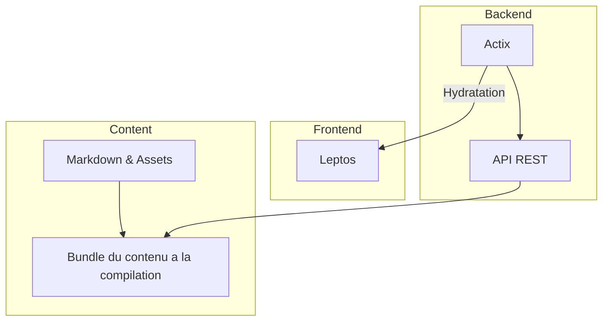

Monofolio-rs est le digne successeur d'un ensemble de projets dont deux ont finis par arrivé sur un projet git (les précédents, je ne connaissais pas encore git).

Chaque projet avait pour but d'expérimenter de nouvelles technologies et approches de concept variées, mais tous avaient pour but finalement de partager un peu de mon monde. Le premier public ([Portfolio](https://github.com/batleforc/portfolio)) était un portfolio classique voué a découvrir les technologies web comme les [SPA](https://en.wikipedia.org/wiki/Single-page_application) ainsi que les [PWA](https://en.wikipedia.org/wiki/Progressive_web_application). Le deuxième, qui est le plus orienté vers la production de contenu et l'utilisation de nouvelles technologies de rendu ([Monofolio](https://github.com/batleforc/monofolio)), avait pour but d'apprendre [Rust](https://www.rust-lang.org/) et [Vue](https://vuejs.org/), de créer un site que je pourrais faire évoluer au fil du temps et m'amuser à ajouter de nouvelles fonctionnalités.

Monofolio-rs est le petit dernier de la famille, il a pour but de parachever le but de monofolio tout en découvrant le développement web en Rust avec [Leptos](https://leptos.dev/). Le projet est encore en développement, mais, si vous me lisez, c'est que vous vous trouvez sur le site de production. N'hésitez pas à explorer le site plus en profondeur et à me faire part de vos commentaires. Je suis toujours preneur de feedbacks constructifs pour améliorer le projet.

## Architecture

Monofolio-rs est organisé en trois parties principales :

- **Frontend** : Utilise Leptos et hydrater par Actix, le frontend est le site web que vous visitez actuellement. Il est responsable de l'affichage du contenu et de l'interaction avec les utilisateurs.
- **Backend**: Utilise Actix, le backend est responsable de la gestion des données. Il expose une API REST pour que le frontend puisse interagir avec les données. Il exposera également à terme le nécessaire à certains EasterEggs.
- **Content**: C'est la partie qui gère la création du "bundle" de contenu. C'est une crate en rust qui s'occupe de transformer les fichiers markdown et les assets en un format facilement consommable par le backend et le frontend. C'est également la partie qui gère la génération des images à partir de diagrammes Mermaid ou la compression des images.

## Content

Le contenu du site est géré à travers des fichiers Yaml et Markdown.
Le fichier Yaml principal est `home.yaml`, celui-ci contient les informations de base du site, comme le titre, une présentation, une description, information de contact, lien utile, histoire, etc.

Les fichiers Markdown sont quant à eux utilisés pour les différentes pages du site, comme [la documentation](/docs) ou [le blog](/blog) sans oublier [les projets](/projects). Une page markdown peut parfaitement remplir les trois rôles. Ces différentes pages respectent la structure CommonMark avec plugins tels que le mermaid ou des codeblocks augmentés par [Shiki](https://github.com/shikijs/shiki).

## Processing du contenu

Le contenu est traité à la compilation grâce à la crate `content`. Cette crate s'occupe de la création du `bundle` de contenu. Au moment du build, tous les fichiers markdown sont transformés en Json et ordonnés pour créer les différentes sidebar et/ou index du site, sans oublier l'ajout de métadonnées dans les fronts matter comme la date de création ou de modification, les tags, etc.

Les assets sont également traités a la compilation:

- Transformation des diagrammes Mermaid en images
- Copie uniquement des assets utilisés et compression de ceux-ci
– Génération des différentes miniatures pour chaque page du site, ainsi que de ma signature mail, via [Takumi-rs](https://github.com/kane50613/takumi).
- Création du feed RSS du blog
- (Et + plus tard ...)

## Conclusion

Ce projet s'inscrit dans un renouveau de mon infrastructure personnelle, avec pour but de partager plus facilement tout ce qui tourne autour de ma veille technique (Café inclus). Je vous souhaite une bonne visite et vous invite à me faire part de vos commentaires et suggestions pour améliorer le projet. N'hésitez pas à explorer le site plus en profondeur et à découvrir les différentes fonctionnalités que j'ai mises en place. Je suis toujours preneur de feedbacks constructifs pour améliorer le projet.

Made with ❤️, too much coffee and a lot of fun by [Max](https://maxleriche.net).
